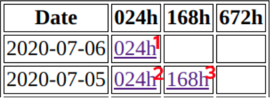
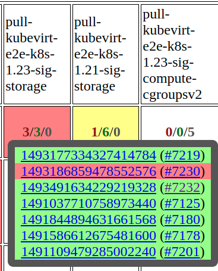

flakefinder
===========

`flakefinder` is a tool to find flaky tests.

`flakefinder` does the following:

1. Report creation
    1. Fetching all merged PRs within a given time period
    2. Getting the last commit of each PR which got merged
    3. Correlate the PR with all prowjobs which were running against this last commit
2. Create/update html documents in GCS bucket /reports/flakefinder/
    1. flakefinder-$date-###h.html - extract skipped/failed/success from the junit results and create a html table
    2. index.html - create page containing all report files from previous point

Selecting the right builds:

- Filter out not merged PRs
- Filter out identical prow jobs on multiple PRs (can be because of the merge pool)
- Filter out jobs which don't have a junit result
- Only shows test results for all lanes where a test at least failed once on one of the found lanes
- Only take prow jobs into account which were run on the commit which got merged

Reports entry page
------------------

The [flakefinder reports entry page](https://storage.googleapis.com/kubevirt-prow/reports/flakefinder/index.html) shows an overview over all projects for which flakefinder reports are generated.

How to read flakefinder reports
-------------------------------

Once you select a project, you are taken to the report overview page.

### Project report overview page

1. daily rolling window report (updated hourly), covers all PRs merged today
1. daily report for yesterday, covers all PRs merged yesterday
1. weekly report from yesterday, covers all PRs merged from six days before yesterday until yesterday

_Not shown here: flakefinder reports for last four weeks (updated once a week)_

### Project report details page

In a nutshell the daily report of day x covers all merged PRs from the start of the day before until the runtime of the report.

Each report contains rows for all tests where at least one test failed on any lane for all PRs that were merged at or after the report date. Rows are sorted according to severity of test failures (i.e the more test fails, the more the test appears at the top of the report

Columns are:
1. link index
2. test name
3. lane aggregation for the test under scope \
   the numbers are: \
   red: number of fails \
   green: number of passes \
   gray: number of skips

**Example: Flakefinder weekly report for KubeVirt**

#### Build popup
When you click on the number where test failures occurred a popup opens:

Here failed test runs are marked as red, also links to the Prow job details page and to the GitHub PR are available.

_Note: The runtime of the reports can be found [here](https://prow.apps.ovirt.org/?job=*flakefinder*)._

How to build flakefinder
-------------------------

In top level directory:

    make robots/flakefinder

### Test flakefinder job locally

Prerequisites:
- a github personal access token in a file `oauth` for the target repo and 
- service account credentials in a file `service-account.json`.

#### Create a job definition using [`mkpj`](https://github.com/kubernetes/test-infra/tree/master/prow/cmd/mkpj)

See job configurations [here](../../../github/ci/prow-deploy/files/jobs/kubevirt/kubevirt/kubevirt-periodics.yaml), use one of the job names from that file.

    mkpj --config-path config.yaml --job-config-path jobs/kubevirt/kubevirt-periodics.yaml --job periodic-publish-flakefinder-xxx-report > /tmp/prowjob.yaml

#### Run the job locally using [`phaino`](https://github.com/kubernetes/test-infra/tree/master/prow/cmd/phaino) 

    phaino --privileged /tmp/prowjob.yaml
    INFO[0000] Reading...                                    path=/tmp/prowjob.yaml
    INFO[0000] Converting job into docker run command...     job=periodic-publish-flakefinder-xxx-report
    local /etc/github path ("token" mount): /path/to/home/.tokens/etc/github
    local /etc/gcs path ("gcs" mount): /path/to/home/.gcs/credentials
    "docker" "run" "--rm=true" \
     "--name=phaino-24602-1" \
     "--entrypoint=/app/robots/flakefinder/app.binary" \                        
     "-e" \                                                                     
     "GOOGLE_APPLICATION_CREDENTIALS=/etc/gcs/service-account.json" \
     "-v" \
     "/path/to/home/.tokens/etc/github:/etc/github" \
     ...
    INFO[0007] Starting job...                               job=periodic-publish-flakefinder-xxx-report
    INFO[0007] Waiting for job to finish...                  container=phaino-24602-1 job=periodic-publish-flakefinder-reports                                                                    
    Unable to find image 'kubevirtci/flakefinder@sha256:491cb61028bd5fcb3ae5ae3e79497f7cf3b4d4e68b70b7471cdc7359a3123e86' locally                                                                 
    sha256:491cb61028bd5fcb3ae5ae3e79497f7cf3b4d4e68b70b7471cdc7359a3123e86: Pulling from kubevirtci/flakefinder                                                                                  
    ...
    2019/08/22 14:43:59 report.go:188: Report will be written to gs://kubevirt-prow/reports/flakefinder/flakefinder-2019-08-22.html                                                               
    2019/08/22 14:44:00 index.go:68: Report index page will be written to gs://kubevirt-prow/reports/flakefinder/index.html                                                                       
    INFO[0145] PASS                                          duration=2m25.918744963s job=periodic-publish-flakefinder-reports                                                                    
    INFO[0145] SUCCESS

#### Check the report

Check report index [here](https://storage.googleapis.com/kubevirt-prow/reports/flakefinder/index.html)
